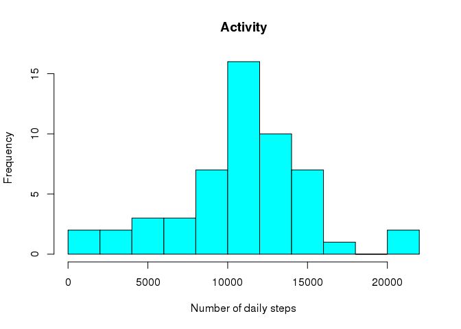

# Reproducible Research: Peer Assessment 1
## Loading and preprocessing the data


```r
dataset <-  read.csv("activity.csv", header = TRUE)
head (dataset)
```

```
##   steps       date interval
## 1    NA 2012-10-01        0
## 2    NA 2012-10-01        5
## 3    NA 2012-10-01       10
## 4    NA 2012-10-01       15
## 5    NA 2012-10-01       20
## 6    NA 2012-10-01       25
```

```r
set.seed(2)
## What is mean total number of steps taken per day? With missing DATA
exercise <- dataset[complete.cases(dataset),]
#str(exercise)
outdata <- aggregate(steps ~ date, data = exercise, sum)
h <- hist(outdata$steps,  
          breaks = 9,  
          freq = T,
          col = "cyan", 
          main = "Activity",
          xlab = "Number of daily steps")
```

 

```r
## What is mean total number of steps taken per day?
steps<-outdata$steps
options(digits = 5)
mean1 <- mean(steps)
mean(steps)
```

```
## [1] 10766
```

```r
median1 <- median(steps)
median(steps)
```

```
## [1] 10765
```

```r
## What is mean total number of steps taken per day? With missing DATA

## I am stuck on interval question and submitting what is working.
```
##### The mean is 1.07662\times 10^{4}   and the median is 10765 for dataset with missing data.


